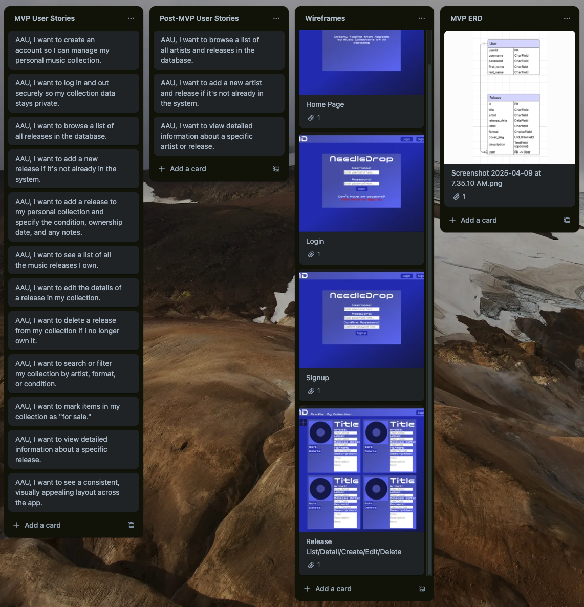
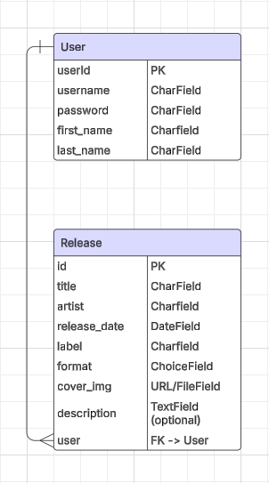

# NeedleDrop

NeedleDrop is a Django we application inspired by [Discogs](https://discogs.com). It allows users to catalog their personal music collection - from vinyl records to CDs and digital releases - while exploring releases by artists, track their ownership details, and managing their own curated archive.

---

## Overview

NeedleDrop was created as a music collection manager that focuses on personal library organization. Users can add artists and releases, and associate those releases with their own collections, including condition, notes, and sales status.

---

## Features

### MVP
- Full CRUD for:
    - Releases
- User authentication
- Pre-filled edit forms
- Responsive layout and UI

### Post-MVP
- Full CRUD for:
    - Artist
    - User collection entries
    - Reviews
- Only the user who owns a collection entry can edit or delete it

---

## Trello Board

[NeedleDrop Trello Board](https://trello.com/b/MBtyMu6W/needledrop)

## User Stories

### MVP
- AAU, I want to create an account so I can manage my personal music collection.
- AAU, I want to log in and out securely so my collection data stays private.
- AAU, I want to browse a list of all releases in the database.
- AAU, I want to add a new release if it's not already in the system.
- AAU, I want to add a release to my personal collection and specify the condition, ownership date, and any notes.
- AAU, I want to see a list of all the music releases I own.
- AAU, I want to edit the details of a release in my collection.
- AAU, I want to delete a release from my collection if i no longer own it.
- AAU, I want to search or filter my collection by artist, format, or condition.
- AAU, I want to mark items in my collection as "for sale."
- AAU, I want to view detailed information about a specific release.
- AAU, I want to see a consistent, visually appealing layout across the app.

### Post-MVP
- AAU, I want to browse a list of all artists and releases in the database.
- AAU, I want to add a new artist and release if it's not already in the system.
- AAU, I want to view detailed information about a specific artist or release.

---

## Technologies Used

- Scheduling & Task Organization:
    - Trello
    - ChatGPT 4o

- Design:
    - Figma

- Development:
    - Python 3
    - Django
    - PostgreSQL
    - HTML 5
    - CSS

- Deployment:
    - Heroku

---

## Data Model Breakdown

### MVP

#### User - 1:M

- [PK] userId
- username: CharField
- password: CharField
- email: Charfield
- first_name: CharField
- last_name: CharField

#### Release - 1:M

- title: CharField
- artist: CharField (Post-MVP: ForeignKey -> Artist)
- release_date: DateField
- label: CharField
- media_format: ChoiceField (Vinyl, CD, Cassette, etc.)
- cover_image: URL or FileField
- description: TextField (optional)

### Post-MVP

#### Artist - 1:M

- name: CharField
- genre: CharField
- bio: TextField (optional)

#### Review - 1:M

- user: ForeignKey -> User
- release: ForeignKey -> Release
- rating: PositiveIntegerField (1-5)
- review_text: TextField (optional)
- created_at: DateTimeField 

#### CollectionEntry - M:M

- user: ForeignKey -> User
- release: ForeignKey -> Release
- condition: ChoiceField (New, Mint, Very Good, etc.)
- owned_since: DateField
- notes: DateField
- is_for_sale: BooleanField

#### WishListItem - M:M

- user: ForeignKey -> User
- release: ForeignKey -> Release
- priority: ChoiceField (High, Medium, Low)
- note: TextField (optional)
- added_at: DatTimeField

---

## Development Guide & Pseudocode

### Notes:
- All work will be done on a `dev` branch.
- Merges to `main` will be committed after testing each specific functionality.
- Final merge to `main` will occur prior to project submission and presentation.

### MVP

#### 0. Web Design Planning (Figma)
- [x] Create a new Figma project: "NeedleDrop UI"
- [x] Define the visual theme (colors, fonts, spacing, branding)
- [x] Sketch a wireframe for each major page:
  - [x] Home / Landing page
  - [x] Login/Register
  - [x] Release List & Detail Page
- [x] Use Frames to define layout using Flexbox-style or grid layout
- [x] Label all components: buttons, navbars, cards, inputs, etc.
- [x] Group reusable UI elements (e.g. release cards, review blocks)
- [ ] Define color palette and check accessibility contrast
- [x] Export or screenshot key screens for use in documentation
- [ ] (Optional) Share Figma link in README for visual reference

#### 1. Project & Git Setup
- [x] Create GitHub repo: `NeedleDrop`
- [x] Clone locally
- [ ] Create and switch to `dev` branch
- [x] Initialize Django project: `django-admin startproject needledrop`
- [x] Create app: `python manage.py startapp collection`
- [x] Install psycopg2 and create PostgreSQL DB
- [x] Connect PostgreSQL in `settings.py`
- [x] Run `migrate` and create superuser

#### 2. Models & Relationships
- [x] Define initial model:
  - [x] Release: title, FK to Artist, format, release_date, cover_image, description
- [x] Run `makemigrations` and `migrate`
- [x] Register all models in `admin.py`

#### 3. Authentication
- [x] Enable login, logout, and register functionality
- [x] Create views/templates for authentication
- [ ] Use `@login_required` on collection
- [ ] Use `` to control access in templates

#### 4. Templates, Base Layout, CRUD Functionality
- [x] Create `base.html` with nav links:
  - Home | My Collection | Login | Logout
- [ ] Create CRUD for Releases
- [ ] Use `` and extend `base.html` in all views
- [ ] Create templates for release list/detail

#### 5. Final Polish
- [ ] Ensure consistent template layout across pages
- [ ] Add alt text for all cover images
- [ ] Style all buttons and forms using CSS Grid/Flexbox
- [ ] Ensure text contrast meets accessibility standards (WCAG AA)
- [ ] Remove unused or commented-out code

#### 6. Deployment & Submission
- [ ] Set up production config for Heroku
- [ ] Configure `ALLOWED_HOSTS` and collect static files
- [ ] Deploy app to hosting platform
- [ ] Finalize `README.md`:
  - [ ] Screenshot
  - [ ] Live app link
  - [ ] User stories
  - [ ] Technologies used
  - [ ] Development schedule
  - [ ] ERD diagram
- [ ] Merge `dev` branch into `main`
- [ ] Push final code and tag submission commit
- [ ] Submit repo and live link

#### 7. Presentation Prep
- [ ] Prepare presentation walkthrough:
  - [ ] What the app does
  - [ ] How it works (models, views, templates)
  - [ ] Key features
  - [ ] Challenges you solved
  - [ ] What you'd add with more time

### Post-MVP

#### Design
- [ ] Wireframe for:
  - [ ] Collection Dashboard
  - [ ] Wishlist Page
  - [ ] Review Section / Form

#### Models & Relationships
- [ ] Define models:
  - [ ] Artist: name, genre, bio
  - [ ] CollectionEntry: FK to User + Release, condition, owned_since, notes, is_for_sale
  - [ ] WishListItem: FK to User + Release, priority, note, added_at
  - [ ] Review: FK to User + Release, rating, review_text, created_at
- [ ] Run `makemigrations` and `migrate`
- [ ] Register all models in `admin.py`

#### Authentication
- [ ] Use `@login_required` on wishlist, review views
- [ ] Use `` to control access in templates

#### Additional Templates
- [ ] Add nav links to `base.html`:
    - My Wishlist | My Reviews
- [ ] Create template for:
    - [ ] Artist list/detail
    - [ ] Wishlist list/detail
    - [ ] Reviews list/detail

#### CollectionEntry CRUD
- [ ] Create view to list user's collection entries
- [ ] Create form to add a release to user's collection
- [ ] Create form to edit collection details (condition, notes, for sale)
- [ ] Create view to delete collection entry
- [ ] Restrict edit/delete buttons to `entry.user == request.user`

#### WishListItem CRUD
- [ ] Create wishlist view for current user
- [ ] Create form to add release to wishlist (with priority and note)
- [ ] Create option to remove from wishlist
- [ ] Prevent duplicate wishlist entries (enforce `unique_together`)
- [ ] Add "Add to Wishlist" button to release detail page

#### Review CRUD
- [ ] Create review form (rating and optional text)
- [ ] Show user's review on release detail page
- [ ] Prevent multiple reviews per user per release (unique constraint)
- [ ] Create views to edit and delete reviews
- [ ] Display average rating on each release detail page

#### Unit Tests (Possible for MVP)
- [ ] Create `tests.py` file
- [ ] Write model tests for Review:
  - [ ] Creation
  - [ ] Uniqueness
  - [ ] Rating value
- [ ] Write model tests for WishListItem:
  - [ ] Creation
  - [ ] Default priority
  - [ ] Uniqueness
- [ ] Run tests with `python manage.py test`

---

## Development Schedule

### MVP

#### April 9th (Wed) - Proposal & Setup
- Create ERD and add to `README.md`
- Finalize project proposal and pitch
- Submit GitHub repo
- Create and switch to `dev` branch
- Finalize data model
- Scaffold Django project `needledrop` and structure for app `collection`
- Set up PostgreSQL in `setting.py`
- Create initial model for `Release`

#### April 9th (Wed) - Auth, Core Models & Initial Deployment
- Implement user authentication (login/register/logout)
- Add login-required restrictions to protected views
- Build list/detail templates for Artists and Releases
- Register users in admin and test base permissions
- Set up `base.html` with nav links and template inheritance
- Initial deployment to Heroku

#### April 10th (Thu) - Styling & Layout Polish
- Finalize `base.html` layout
- Apply Flexbox/Grid for layout consistency
- Ensure visual theme consistency
- Add contrast-compliant colors
- Style all buttons and forms
- Add `alt` text to all images

#### April 11th (Fri) - User Views & Filtering
- Build user-specific dashboard for My Collection
- Add basic filters (by artist, format, etc.)
- Ensure public detail pages are accessible

#### April 12th - 14th (Sat - Mon) - Debugging, Deployment, Additional Styling
- Debug all known issues
- Dial in final styling
- Final polish of `README.md` (screenshot, links, stories)
- Final merge `dev` → `main`
- Tag commit for submission

#### April 15th (Tue) - Submission & Presentation
- Submit GitHub repo + live app link
- Present to class:
  - What it does
  - How it works
  - Features you're proud of
  - Challenges you solved

### Post-MVP

#### Additional Models
- Add initial models for:
    - `Artist`
    - `CollectionEntry`
    - `Review`
    - `WishListItem`

#### CRUD: `CollectionEntry`
- Build collection views (list, create, update, delete)
- Tie entries to current user only
- Use Django forms with prefilled data for editing
- Add logic to only show edit/delete to entry owner
- Test form validation

#### CRUD: `Reviews` & `WishListItems`
- Create `Review` form and views (add/edit/delete)
- Prevent duplicate reviews per user/release
- Create `WishListItem` views and templates
- Allow priority setting and optional note
- Add/remove wishlist buttons on release detail page

#### Additional User Views
- Add dashboards for:
    - My Reviews
    - My Wishlist
- Add review average/star visual

#### Unit Testing
- Write tests for:
  - Review: creation, unique constraint
  - WishListItem: default priority, uniqueness
- Run full test suite (`python manage.py test`)
- Debug all known issues
- Final polish of `README.md` (screenshot, links, stories)
- Final merge `dev` → `main`
- Tag commit for final deployment

---

### Stretch Goals & Post-MVP

- Review and implement all Post-MVP features
- Implement search and filter tools by artist, genre, or format
- Public user profiles and browsing others' collections
- Tagging system for releases
- Add cover art upload feature
- Marketplace integration and/or price tracking with Stripe

---

## Conclusion

NeedleDrop is a focused, user-first music cataloging app that demonstrates an understanding of Django's architecture, user authentication, and relational data modeling.